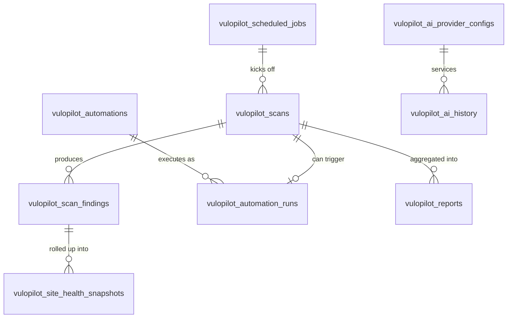

# VuloPilot — database schema

All tables below live in the **Free** plugin's schema (`Utill::TABLES`, created by Free's
`Install.php`) — per `.claude/rules/database.md`, table ownership is centralized in the free
plugin for every existing product line, and VuloPilot Pro has no independent database of its own.
A Pro-only feature (e.g. `ComplianceReports`) still writes into a table defined here; it just
leaves that table empty/unused until the module is licensed and active. This avoids splitting
migration ownership across two plugins, which nothing in this repo does today. (Confirmed against
`plugins/vulopilot-pro/`: zero `CREATE TABLE` statements anywhere in its real code — the scope
claim above still holds.)

`Utill::TABLES` has grown to **24 entries** since this doc was first written — the original 13-table
`1.0.0` baseline (tables 1–13 below) plus 11 tables added one-at-a-time in later passes (tables
14–24 below), each still created/owned entirely by Free's `Install.php`.


> **Consolidated tables (current schema).** Where the sections below still show the original one-table-per-feature sketch, the shipped schema merged these:
> - `vulopilot_ai_provider_configs` and `vulopilot_backup_storage_configs` were removed: no AI provider key is stored locally (VuloCloud holds them), and Backups' S3/Drive credentials live in one encrypted, non-autoloaded option (`vulopilot_backup_storage_credentials`, `Services\BackupCredentialStore`).
> - `vulopilot_performance_requests` + `vulopilot_core_web_vitals` → **`vulopilot_performance_samples`** (`sample_type` = `request` | `vital`).
> - Eight daily score-history tables (performance/security score, accessibility, site health, store trends, brand score, GEO visibility, Knowledge Graph health) → **`vulopilot_snapshots`** (`snapshot_type` + `snapshot_date` unique, values as JSON in `data`; `Repositories\SnapshotRepository`).
> - `vulopilot_rules` and `vulopilot_ai_jobs` were removed (never used).
> - `vulopilot_login_attempts` + `vulopilot_firewall_blocks` → **`vulopilot_security_events`** (`event_type` = `login_attempt` | `firewall_block`).
> - `vulopilot_indexnow_log` was removed: submissions are rows in `vulopilot_activity_logs` (`event_type` = `indexnow.submitted`, details in `meta`).
> - **Pro-only tables now live in vulopilot-pro**, not Free: `vulopilot_scheduled_jobs`, `vulopilot_keyword_rankings`, `vulopilot_brand_mentions`, `vulopilot_entity_relationships`, `vulopilot_file_baselines` are created by `VuloPilotPro\Install::ensure_tables()` and read/written through Pro's own repositories (`Install::TABLES` is their registry). Free creates 17 tables; Pro adds these 5.
> The plugin is unreleased, so there are no upgrade/migration steps for any of this — tables are created fresh by `Install::install()`.

## Design principles (matched against the real schema in `vulolabs/plugins/vulopilot/classes/Install.php`)

- **`bigint(20) unsigned` primary keys, `AUTO_INCREMENT`, lower-case `id`** — the existing schema is
  inconsistent between `` `ID` `` and `` `id` `` across tables (legacy vs. newer ones, e.g.
  `transaction` uses lower-case `id` with `unsigned`, older tables use `` `ID` `` without
  `unsigned`). VuloPilot is new, so it standardizes on the newer, stricter `transaction`-table style
  throughout: lower-case `id`, `unsigned` on every bigint.
- **Typed foreign-key *columns*, not real `FOREIGN KEY ... REFERENCES` constraints.** Grepping
  `Install.php` shows zero `REFERENCES`/`FOREIGN KEY` clauses anywhere in the existing schema —
  this codebase relies on plain indexed `bigint` columns (`store_id`, `order_id`,
  `commission_id`) plus application-layer integrity (the Repository classes), not database-enforced
  referential integrity. This is also a `dbDelta()` limitation (it doesn't reliably diff constraint
  clauses) and matches WordPress core's own tables (`wp_postmeta`, `wp_options` have no FKs
  either). VuloPilot follows the same convention — every `*_id` column below is a plain indexed
  `bigint(20) unsigned`, not a constraint.
- **`object_type` + `object_id` only where the target genuinely varies by row** (`vulopilot_scan_findings.object_ref`,
  `vulopilot_ai_history`/`vulopilot_activity_logs`). This isn't a general
  polymorphic-association framework bolted on — the existing schema always uses a specific typed
  column (`store_id`, `product_id`) when the target is a single known entity, and this design does
  the same everywhere a specific target type exists (`vulopilot_automations.rule_id`,
  `vulopilot_automation_runs.automation_id`). The generic pair is used strictly for the handful of
  tables whose whole purpose is to reference heterogeneous, unpredictable targets (a finding might
  be about a plugin slug, a file path, or a URL — no single typed column works there). None of the
  11 tables added since (14–24 below) use this pair either — `vulopilot_entity_relationships` comes
  closest to a polymorphic shape but still uses typed `from_entity_id`/`to_entity_id` string columns
  scoped to its own synthetic id format, not the generic `object_type`/`object_id` pair.
- **`longtext` for JSON payloads**, matching the existing `commission_note`/similar `longtext`
  columns — no existing table uses MySQL's native `JSON` column type, so this doesn't introduce a
  new column type the rest of the schema doesn't use. Encode/decode via `wp_json_encode()`/
  `json_decode()` in the Repository layer, same as any other serialized column in this codebase.
- **`$wpdb->get_charset_collate()`, `CREATE TABLE IF NOT EXISTS`, `dbDelta()`** — identical to
  every existing migration block.
- **No table is deleted or repurposed by a later migration** — additive only, per
  `.claude/rules/backward-compatibility.md`.

## Table registry (`Utill::TABLES`, free plugin)

```php
const TABLES = array(
    'scan'                   => 'vulopilot_scans',
    'scan_finding'           => 'vulopilot_scan_findings',
    'automation'             => 'vulopilot_automations',
    'automation_run'         => 'vulopilot_automation_runs',
    'ai_history'             => 'vulopilot_ai_history',
    'ai_provider_config'     => 'vulopilot_ai_provider_configs',
    'report'                 => 'vulopilot_reports',
    'scheduled_job'          => 'vulopilot_scheduled_jobs',
    'activity_log'           => 'vulopilot_activity_logs',
    'site_health_snapshot'   => 'vulopilot_site_health_snapshots',
    'ai_action_run'          => 'vulopilot_ai_action_runs',
    'crawler_visit'          => 'vulopilot_crawler_visits',
    'redirect'               => 'vulopilot_redirects',
    'not_found_log'          => 'vulopilot_not_found_logs',
    'indexnow_log'           => 'vulopilot_indexnow_log',
    'geo_visibility_history' => 'vulopilot_geo_visibility_history',
    'brand_score_history'    => 'vulopilot_brand_score_history',
    'entity_relationship'    => 'vulopilot_entity_relationships',
    'kg_health_history'      => 'vulopilot_kg_health_history',
    'file_baseline'          => 'vulopilot_file_baselines',
    'accessibility_snapshot' => 'vulopilot_accessibility_snapshots',
    'store_trends_snapshot'  => 'vulopilot_store_trends_snapshots',
);
```

`ai_action_run` was added in the AI Actions pass — see [`AI-ACTIONS.md`](AI-ACTIONS.md) for its
full design (table #13, documented after table 12 below rather than renumbering everything). The
11 entries after it (`crawler_visit` through `store_trends_snapshot`) were each added in a later,
separate pass — tables 14–24 below, in the same order `Install.php`'s own
`create_database_tables()`/`do_migration()` create them.

## Entity relationships



This diagram was never meant to be exhaustive — it already omits `vulopilot_activity_logs` and
`vulopilot_ai_action_runs` from the original 13. The 11 tables added since (14–24 below) are left
off for the same reason: each is either a standalone log with no FK-shaped column to another
custom table (`vulopilot_crawler_visits`, `vulopilot_redirects`, `vulopilot_not_found_logs`,
`vulopilot_indexnow_log`), a daily rollup computed live from `vulopilot_scan_findings` the same way
`vulopilot_site_health_snapshots` already is (`vulopilot_geo_visibility_history`,
`vulopilot_brand_score_history`, `vulopilot_kg_health_history`, `vulopilot_accessibility_snapshots`),
a rollup of real WooCommerce order data rather than findings (`vulopilot_store_trends_snapshots`),
or a self-contained edge list keyed to synthetic entity ids that aren't rows in any other custom
table (`vulopilot_entity_relationships`, `vulopilot_file_baselines`).

---

## 1. `vulopilot_scans` — a single scan run

One row per invocation of any scanner (free or premium), regardless of what triggered it. This is
the parent of `vulopilot_scan_findings` and the thing `vulopilot_scheduled_jobs`/
`vulopilot_automations` point at when they say "run a scan."

```sql
CREATE TABLE IF NOT EXISTS `{$wpdb->prefix}vulopilot_scans` (
    `id`            bigint(20) unsigned NOT NULL AUTO_INCREMENT,
    `scanner_id`    varchar(100) NOT NULL,
    `scanner_tier`  varchar(20) NOT NULL DEFAULT 'free',
    `status`        varchar(20) NOT NULL DEFAULT 'queued',
    `trigger_type`  varchar(20) NOT NULL DEFAULT 'manual',
    `triggered_by`  bigint(20) unsigned DEFAULT NULL,
    `started_at`    datetime DEFAULT NULL,
    `finished_at`   datetime DEFAULT NULL,
    `duration_ms`   int(10) unsigned DEFAULT NULL,
    `summary`       longtext DEFAULT NULL,
    `error_message` text DEFAULT NULL,
    `created_at`    timestamp NOT NULL DEFAULT CURRENT_TIMESTAMP,
    PRIMARY KEY (`id`),
    KEY `idx_scanner` (`scanner_id`),
    KEY `idx_status` (`status`),
    KEY `idx_created` (`created_at`)
) $collate;
```

- `scanner_id` — the scanner's registered id from `ScannerRegistry` (free scanner slug, or a Pro
  module's scanner slug) — a string, not a typed FK, because scanners aren't rows in a table, they're
  code registered via the `vulopilot_scanner_sources` filter.
- `scanner_tier` (`free`/`premium`) — denormalized so the dashboard's scan-history list can filter
  by tier without joining back to the module registry (`.claude/rules/performance.md`'s
  "prefer a single query" guidance, applied to a list endpoint).
- `status` (`queued`/`running`/`completed`/`failed`/`cancelled`) — `idx_status` backs the
  `Scans` REST controller's list-filter-by-status query and the Scheduler's "any stuck scans"
  health check.
- `trigger_type` (`manual`/`scheduled`/`automation`) + `triggered_by` (user id, `NULL` if system) —
  who/what asked for this scan; needed for the activity log and for "run manually" UI affordances.
- `summary` — JSON rollup (finding counts by severity) computed once the scan finishes, so the
  dashboard's scan list doesn't have to `COUNT()` `vulopilot_scan_findings` per row on every page
  load.
- `idx_created` — every list endpoint here is ordered by recency; an unindexed `created_at` sort on
  a growing table is the first thing that gets slow.

## 2. `vulopilot_scan_findings` — individual findings from a scan

```sql
CREATE TABLE IF NOT EXISTS `{$wpdb->prefix}vulopilot_scan_findings` (
    `id`            bigint(20) unsigned NOT NULL AUTO_INCREMENT,
    `scan_id`       bigint(20) unsigned NOT NULL,
    `scanner_id`    varchar(100) NOT NULL,
    `severity`      varchar(20) NOT NULL DEFAULT 'info',
    `category`      varchar(50) NOT NULL,
    `title`         varchar(255) NOT NULL,
    `description`   longtext DEFAULT NULL,
    `object_type`   varchar(50) DEFAULT NULL,
    `object_ref`    varchar(255) DEFAULT NULL,
    `status`        varchar(20) NOT NULL DEFAULT 'open',
    `resolved_at`   datetime DEFAULT NULL,
    `meta`          longtext DEFAULT NULL,
    `created_at`    timestamp NOT NULL DEFAULT CURRENT_TIMESTAMP,
    PRIMARY KEY (`id`),
    KEY `idx_scan` (`scan_id`),
    KEY `idx_severity` (`severity`),
    KEY `idx_status` (`status`),
    KEY `idx_category` (`category`)
) $collate;
```

- `scan_id` — typed FK column to `vulopilot_scans.id`; `idx_scan` is what makes "show findings for
  this scan" (the dashboard's primary findings view) an indexed lookup instead of a table scan.
- `scanner_id` — denormalized from the parent scan so "all open critical findings across every
  scan, by scanner" doesn't require a join, matching the `performance.md` guidance to prefer a
  single indexed query over a join-per-row pattern for list endpoints.
- `severity` (`critical`/`high`/`medium`/`low`/`info`) — `idx_severity` backs the dashboard's
  "critical findings" widget and the Rule Engine's `finding.severity` condition type.
- `object_type` + `object_ref` — the one deliberate use of the loose polymorphic pair (see design
  principles above): a finding might be about a plugin slug, a theme, a core file, a URL, or a
  database table — there's no single typed entity table to point a real FK at.
- `status` (`open`/`resolved`/`ignored`/`snoozed`) — separate from `vulopilot_scans.status`; a scan
  finishes once, but a finding's lifecycle continues independently (someone can resolve/snooze it
  days later). `idx_status` backs the default "open findings" dashboard filter.

## 3. ~~`vulopilot_rules`~~ — removed

Never had a reader or writer (rules are code-defined, `RuleEngine\RuleRegistry`), so the table
was dropped. A future custom-rule builder would re-introduce its own table.

## 4. `vulopilot_automations` — binds a trigger + conditions to actions

**Superseded from the original sketch below** — see
[`AUTOMATION-ENGINE-MODULE.md`](AUTOMATION-ENGINE-MODULE.md) for the full,
current design. `rule_id` was originally a `NOT NULL` FK to
`vulopilot_rules` (the still-unbuilt user-authored-custom-rules table
below); the real, shipped `Automation\AutomationEngine` instead binds an
automation to one of the code-defined `RuleInterface` rules by string id
(`trigger_config.rule_key`), never a row in `vulopilot_rules` — this
column was loosened to nullable rather than removed (`Install::relax_automation_rule_id_to_nullable()`),
since it's additive/non-destructive and no released version had ever
populated it.

```sql
CREATE TABLE IF NOT EXISTS `{$wpdb->prefix}vulopilot_automations` (
    `id`                  bigint(20) unsigned NOT NULL AUTO_INCREMENT,
    `name`                varchar(191) NOT NULL,
    `rule_id`             bigint(20) unsigned DEFAULT NULL,
    `trigger_type`        varchar(50) NOT NULL,
    `trigger_config`      longtext DEFAULT NULL,
    `conditions`          longtext DEFAULT NULL,
    `actions`             longtext NOT NULL,
    `status`              varchar(20) NOT NULL DEFAULT 'enabled',
    `last_triggered_at`   datetime DEFAULT NULL,
    `created_by`          bigint(20) unsigned DEFAULT NULL,
    `created_at`          timestamp NOT NULL DEFAULT CURRENT_TIMESTAMP,
    `updated_at`          timestamp NOT NULL DEFAULT CURRENT_TIMESTAMP ON UPDATE CURRENT_TIMESTAMP,
    PRIMARY KEY (`id`),
    KEY `idx_rule` (`rule_id`),
    KEY `idx_status` (`status`),
    KEY `idx_trigger_type` (`trigger_type`)
) $collate;
```

- `rule_id` — unused (see above); kept nullable rather than dropped, per
  `.claude/rules/backward-compatibility.md`'s additive-only rule.
- `trigger_type` — one of `Automation\TriggerRegistry`'s registered trigger
  ids (`manual`/`hourly`/`daily`/`weekly`/`monthly`/`post_published`/
  `product_created`/`product_updated`/`order_completed`/`user_registered`/
  a Pro-registered trigger like Knowledge Graph's `knowledge_graph_built`).
  `trigger_config` is JSON, currently just `{rule_key: string|null}` — the
  `RuleInterface::get_id()` this automation is bound to, or `null` to match
  any rule's recommendations. `idx_trigger_type` backs
  `AutomationEngine::get_enabled_automations_for_trigger()`'s query.
- `conditions` (AUTOMATION-ENGINE-MODULE.md's "Conditions") — JSON ordered
  list of `{type, config}`, each `type` a registered
  `ConditionInterface::get_id()`; every one must match (ANDed) on top of
  the bound rule, or `null`/empty to skip this layer entirely. Same
  "one JSON column, not a child table" reasoning `actions` below already
  uses.
- `actions` — JSON ordered list of `{type, config}`; each `type` is
  whatever's registered via `vulopilot_automation_action_sources` (Pro's
  4 built-in actions) or Free's own much smaller
  `vulopilot_manual_action_sources` (used only by `Automation\ManualActionRunner`,
  never by a `vulopilot_automations` row — see AUTOMATION-ENGINE-MODULE.md).
- `status` (`enabled`/`disabled`) — pause without delete.

## 5. `vulopilot_automation_runs` — execution history of automations

```sql
CREATE TABLE IF NOT EXISTS `{$wpdb->prefix}vulopilot_automation_runs` (
    `id`                bigint(20) unsigned NOT NULL AUTO_INCREMENT,
    `automation_id`     bigint(20) unsigned NOT NULL,
    `triggered_by`      varchar(50) NOT NULL,
    `trigger_ref_id`    bigint(20) unsigned DEFAULT NULL,
    `status`            varchar(20) NOT NULL DEFAULT 'running',
    `actions_executed`  int(10) unsigned NOT NULL DEFAULT 0,
    `actions_failed`    int(10) unsigned NOT NULL DEFAULT 0,
    `result_log`        longtext DEFAULT NULL,
    `retry_count`       tinyint(3) unsigned NOT NULL DEFAULT 0,
    `started_at`        datetime NOT NULL,
    `finished_at`       datetime DEFAULT NULL,
    `created_at`        timestamp NOT NULL DEFAULT CURRENT_TIMESTAMP,
    PRIMARY KEY (`id`),
    KEY `idx_automation` (`automation_id`),
    KEY `idx_status` (`status`),
    KEY `idx_started` (`started_at`)
) $collate;
```

- Separate from `vulopilot_automations` for the same reason `vulopilot_scans` is separate from the
  scanner registry: the automation is the *definition* (edited rarely), a run is an *event* (written
  every time it fires, potentially very often) — mixing update-rarely config columns with
  write-constantly history columns on one table just makes the config rows wider and the history
  rows sparser than they need to be.
- `status` is one of `running`/`completed`/`failed` (`AutomationEngine::run_automation()`/`retry_run()`)
  — not `success`/`failure`, a real mismatch a previous pass's own
  `AutomationRunRepository::get_breakdown_by_automation_for_period()` and
  `Reports\Types\AutomationReport` had baked in (both always read `0`
  succeeded/failed, since neither status string they checked for was ever
  actually written); fixed alongside AUTOMATION-ENGINE-MODULE.md's "Retries".
- `trigger_ref_id` — e.g. the specific object id a `post_published`-style automation fired for;
  nullable because `manual`/periodic-cron triggers have no such reference.
- `result_log` — JSON, one entry per action executed
  (`ValueObjects\AutomationRunResult::to_array()`: `{success, action_id, message}`) — the concrete
  audit trail an admin reads when an automation "did something" and they need to know what
  ("Logs", AUTOMATION-ENGINE-MODULE.md).
- `retry_count` (AUTOMATION-ENGINE-MODULE.md's "Retries") — how many times
  `AutomationEngine::retry_run()` has re-attempted this run's failed
  actions, capped at the `automation_max_retries` setting.

## 6. ~~`vulopilot_ai_jobs`~~ — removed

An AI work queue that was never wired up: AI calls settle straight into `vulopilot_ai_history`.
The table was dropped.

## 7. `vulopilot_ai_history` — permanent ledger of completed AI calls

```sql
CREATE TABLE IF NOT EXISTS `{$wpdb->prefix}vulopilot_ai_history` (
    `id`                  bigint(20) unsigned NOT NULL AUTO_INCREMENT,
    `provider`            varchar(50) NOT NULL,
    `model`               varchar(100) DEFAULT NULL,
    `object_type`         varchar(50) DEFAULT NULL,
    `object_id`           bigint(20) unsigned DEFAULT NULL,
    `prompt_tokens`       int(10) unsigned DEFAULT NULL,
    `completion_tokens`   int(10) unsigned DEFAULT NULL,
    `cost_estimate`       decimal(10,4) DEFAULT NULL,
    `status`              varchar(20) NOT NULL,
    `response_excerpt`    text DEFAULT NULL,
    `requested_by`        bigint(20) unsigned DEFAULT NULL,
    `created_at`          timestamp NOT NULL DEFAULT CURRENT_TIMESTAMP,
    PRIMARY KEY (`id`),
    KEY `idx_provider` (`provider`),
    KEY `idx_created` (`created_at`),
    KEY `idx_object` (`object_type`, `object_id`)
) $collate;
```

- Every AI call writes exactly one row here directly — there is no separate job queue table (`job_id` and
  `vulopilot_ai_jobs` were removed; nothing ever wrote them).
- `prompt_tokens`/`completion_tokens`/`cost_estimate` — this is the table `vulopilot_ai_provider_configs.quota_used`
  gets recalculated from and what a future billing/usage screen queries; keeping it append-only and
  separate from the job queue means quota math never has to account for jobs being pruned.
- `response_excerpt`, not the full response — this is an audit trail, not a cache; storing full AI
  responses indefinitely is a data-retention/PII surface area this design avoids by only keeping
  enough to show "what did the AI say" in an audit view.

## 8. `vulopilot_ai_provider_configs` — configured AI provider credentials

```sql
CREATE TABLE IF NOT EXISTS `{$wpdb->prefix}vulopilot_ai_provider_configs` (
    `id`                bigint(20) unsigned NOT NULL AUTO_INCREMENT,
    `provider`          varchar(50) NOT NULL,
    `label`             varchar(191) DEFAULT NULL,
    `credentials`       longtext NOT NULL,
    `default_model`     varchar(100) DEFAULT NULL,
    `is_active`         tinyint(1) NOT NULL DEFAULT 1,
    `quota_limit`       int(10) unsigned DEFAULT NULL,
    `quota_used`        int(10) unsigned NOT NULL DEFAULT 0,
    `quota_reset_at`    datetime DEFAULT NULL,
    `created_at`        timestamp NOT NULL DEFAULT CURRENT_TIMESTAMP,
    `updated_at`        timestamp NOT NULL DEFAULT CURRENT_TIMESTAMP ON UPDATE CURRENT_TIMESTAMP,
    PRIMARY KEY (`id`),
    UNIQUE KEY `uniq_provider` (`provider`),
    KEY `idx_active` (`is_active`)
) $collate;
```

- **`credentials` must never hold a plaintext API key.** This is flagged in `ARCHITECTURE.md` too:
  nothing in this repo today encrypts a secret at rest (the existing `LicenseManager` stores a
  *license key*, which is validated against VuloLabs's own server, not a third-party API
  credential with direct spend risk) — so this column's encryption approach is new ground for the
  codebase, not a pattern being copied. At minimum: encrypt with a key derived from WordPress's own
  `AUTH_KEY`/`SECURE_AUTH_KEY` salts (never store the encryption key in the same table/row), decrypt
  only inside the `AIProviders/Providers/*` class that makes the actual HTTP call, and never return
  `credentials` from any REST response (the `Providers` controller should expose `label`,
  `provider`, `is_active`, `default_model`, masked-last-4 only).
- `quota_limit`/`quota_used`/`quota_reset_at` — free tier's built-in rate limiting on the default
  provider, and the mechanism Pro's `MultiProviderAI` module reuses per-provider rather than
  inventing its own quota system.
- `UNIQUE KEY uniq_provider` — one configuration row per provider slug; re-saving a provider's
  settings is an `UPDATE`, not an `INSERT`, by design.

## 9. `vulopilot_reports` — generated reports

```sql
CREATE TABLE IF NOT EXISTS `{$wpdb->prefix}vulopilot_reports` (
    `id`             bigint(20) unsigned NOT NULL AUTO_INCREMENT,
    `report_type`    varchar(50) NOT NULL,
    `format`         varchar(10) NOT NULL DEFAULT 'pdf',
    `period_start`   date DEFAULT NULL,
    `period_end`     date DEFAULT NULL,
    `status`         varchar(20) NOT NULL DEFAULT 'generating',
    `file_path`      varchar(255) DEFAULT NULL,
    `generated_by`   bigint(20) unsigned DEFAULT NULL,
    `meta`           longtext DEFAULT NULL,
    `created_at`     timestamp NOT NULL DEFAULT CURRENT_TIMESTAMP,
    PRIMARY KEY (`id`),
    KEY `idx_type` (`report_type`),
    KEY `idx_status` (`status`),
    KEY `idx_period` (`period_start`, `period_end`)
) $collate;
```

- `file_path` — a path under `wp-content/uploads/vulopilot-reports/` (or similar), never a
  web-reachable URL returned directly; the REST download endpoint should stream the file through a
  permission-checked handler rather than exposing the path, same "don't trust the client with a raw
  path" posture as `security.md`'s escaping/sanitizing baseline.
- `meta` — JSON: which `scan_id`s/date range fed this report, filters applied — lets a report be
  regenerated or its provenance inspected without re-deriving it from `period_start`/`period_end`
  alone.
- This table exists in Free's schema even though report *generation* is a Pro module
  (`ComplianceReports`) — see the file-level note at the top: schema ownership doesn't fragment by
  license tier.

## 10. `vulopilot_scheduled_jobs` — Scheduler's queryable job registry

```sql
CREATE TABLE IF NOT EXISTS `{$wpdb->prefix}vulopilot_scheduled_jobs` (
    `id`                bigint(20) unsigned NOT NULL AUTO_INCREMENT,
    `job_key`           varchar(100) NOT NULL,
    `job_type`          varchar(50) NOT NULL,
    `schedule`          varchar(50) NOT NULL,
    `config`            longtext DEFAULT NULL,
    `is_enabled`        tinyint(1) NOT NULL DEFAULT 1,
    `next_run_at`       datetime DEFAULT NULL,
    `last_run_at`       datetime DEFAULT NULL,
    `last_run_status`   varchar(20) DEFAULT NULL,
    `created_at`        timestamp NOT NULL DEFAULT CURRENT_TIMESTAMP,
    `updated_at`        timestamp NOT NULL DEFAULT CURRENT_TIMESTAMP ON UPDATE CURRENT_TIMESTAMP,
    PRIMARY KEY (`id`),
    UNIQUE KEY `uniq_job_key` (`job_key`),
    KEY `idx_enabled` (`is_enabled`),
    KEY `idx_next_run` (`next_run_at`)
) $collate;
```

- **This does not replace `wp_schedule_event()`/wp-cron** — the actual scheduling still goes through
  WordPress core's cron API, same as the existing `Cron.php` pattern. This table is a *companion*
  queryable projection: wp-cron's own storage (a single serialized array in the `cron` option) can't
  be efficiently listed, sorted, or filtered by a REST endpoint, and it has no concept of "did the
  last run succeed." `Scheduler.php` writes/updates a row here every time it schedules or runs a job,
  purely so the dashboard's "Scheduled Jobs" screen and the `Scans`/monitoring REST endpoints have
  something to query.
- `job_key` unique — one row per distinct scheduled job (`daily-core-scan`,
  `weekly-compliance-report`, `ai-quota-reset`), matching how `wp_schedule_event()` itself is keyed
  by hook name + args.
- `last_run_status` — what lets the dashboard surface "this scheduled scan has been failing for 3
  days" instead of only showing that it's scheduled at all.

## 11. `vulopilot_activity_logs` — general audit trail

```sql
CREATE TABLE IF NOT EXISTS `{$wpdb->prefix}vulopilot_activity_logs` (
    `id`            bigint(20) unsigned NOT NULL AUTO_INCREMENT,
    `event_type`    varchar(100) NOT NULL,
    `object_type`   varchar(50) DEFAULT NULL,
    `object_id`     bigint(20) unsigned DEFAULT NULL,
    `actor_type`    varchar(20) NOT NULL DEFAULT 'system',
    `actor_id`      bigint(20) unsigned DEFAULT NULL,
    `message`       text NOT NULL,
    `severity`      varchar(20) NOT NULL DEFAULT 'info',
    `meta`          longtext DEFAULT NULL,
    `created_at`    timestamp NOT NULL DEFAULT CURRENT_TIMESTAMP,
    PRIMARY KEY (`id`),
    KEY `idx_event` (`event_type`),
    KEY `idx_object` (`object_type`, `object_id`),
    KEY `idx_created` (`created_at`)
) $collate;
```

- Shaped like a typical activity-log table (`` `ID` ``, `message`, `event_type`, `created_at`)
  with two additions a simpler marketplace-style activity log wouldn't need:
  `object_type`/`object_id` (VuloPilot's log entries reference many different entity types — scans,
  rules, automations, AI jobs — where the marketplace log is scoped to one thing, a store) and
  `actor_type`/`actor_id` (VuloPilot logs system/automation-originated events, not only user
  actions, so "who did this" needs a type discriminator the marketplace log doesn't need).
- `severity` reuses the same vocabulary as `vulopilot_scan_findings.severity` deliberately, so the
  dashboard's existing severity badge component (a Zyra status-badge instance) renders both without
  a second color-mapping table (`.claude/rules/accessibility.md`'s "color is never the only signal"
  guidance applies equally here — pair with the text label, which `event_type`/`message` already
  provide).
- Also where `Sdk\ExtensionManager` writes `extension.incompatible`/`extension.registration_failed`
  events (`EXTENSION-SDK.md`) — not only scanner/automation events; `event_type` is a free-form
  string, not an enum, precisely so new subsystems can log into this one table without a schema
  change.

## 12. `vulopilot_site_health_snapshots` — daily aggregate rollup

```sql
CREATE TABLE IF NOT EXISTS `{$wpdb->prefix}vulopilot_site_health_snapshots` (
    `id`                  bigint(20) unsigned NOT NULL AUTO_INCREMENT,
    `snapshot_date`       date NOT NULL,
    `overall_score`       tinyint(3) unsigned NOT NULL,
    `security_score`      tinyint(3) unsigned DEFAULT NULL,
    `performance_score`   tinyint(3) unsigned DEFAULT NULL,
    `seo_score`           tinyint(3) unsigned DEFAULT NULL,
    `uptime_score`        tinyint(3) unsigned DEFAULT NULL,
    `critical_count`      int(10) unsigned NOT NULL DEFAULT 0,
    `high_count`          int(10) unsigned NOT NULL DEFAULT 0,
    `medium_count`        int(10) unsigned NOT NULL DEFAULT 0,
    `low_count`           int(10) unsigned NOT NULL DEFAULT 0,
    `created_at`          timestamp NOT NULL DEFAULT CURRENT_TIMESTAMP,
    PRIMARY KEY (`id`),
    UNIQUE KEY `uniq_snapshot_date` (`snapshot_date`)
) $collate;
```

- **Why this exists separately from just querying `vulopilot_scan_findings` live**: the dashboard's
  headline feature is a health-score trend chart (score over the last 30/90 days). Computing that by
  aggregating potentially tens of thousands of finding rows on every dashboard load is exactly the
  kind of query `.claude/rules/performance.md` warns against — this table is a once-daily
  precomputed rollup (written by a `vulopilot_scheduled_jobs` entry after each day's scans finish) so
  the trend chart is a single indexed range query (`WHERE snapshot_date BETWEEN ? AND ?`) instead of
  a live aggregation.
- `UNIQUE KEY uniq_snapshot_date` — enforces one rollup per day; the scheduled job that writes this
  does an upsert (`ON DUPLICATE KEY UPDATE`) so re-running it the same day is idempotent.
- **Still only partially populated**: `security_score`/`performance_score`/`seo_score`/`uptime_score`
  exist as columns, but nothing in this codebase writes them today — `overall_score` is the only one
  `ScanPersistenceListener::refresh_todays_snapshot()` actually upserts. `DASHBOARD-WIDGETS.md`'s
  Dashboard category scores are computed live from `vulopilot_scan_findings` instead of reading these
  columns for exactly that reason (a `NULL` here would be indistinguishable from "not implemented").

## 13. `vulopilot_ai_action_runs` — AI Action propose/approve/execute/rollback history

Added in the AI Actions pass — see [`AI-ACTIONS.md`](AI-ACTIONS.md) for the full design (the
8-stage action lifecycle this table exists to bridge). Full column list there; short version:

```sql
CREATE TABLE IF NOT EXISTS `{$wpdb->prefix}vulopilot_ai_action_runs` (
    `id`             bigint(20) unsigned NOT NULL AUTO_INCREMENT,
    `action_id`      varchar(100) NOT NULL,
    `status`         varchar(20) NOT NULL DEFAULT 'pending_approval',
    `object_type`    varchar(50) DEFAULT NULL,
    `object_ref`     varchar(255) DEFAULT NULL,
    `input`          longtext DEFAULT NULL,
    `output`         longtext DEFAULT NULL,
    `preview`        longtext DEFAULT NULL,
    `snapshot`       longtext DEFAULT NULL,
    `error_message`  text DEFAULT NULL,
    `requested_by`   bigint(20) unsigned DEFAULT NULL,
    `approved_by`    bigint(20) unsigned DEFAULT NULL,
    `created_at`     timestamp NOT NULL DEFAULT CURRENT_TIMESTAMP,
    `approved_at`    datetime DEFAULT NULL,
    `executed_at`    datetime DEFAULT NULL,
    `rolled_back_at` datetime DEFAULT NULL,
    PRIMARY KEY (`id`),
    KEY `idx_action` (`action_id`),
    KEY `idx_status` (`status`),
    KEY `idx_object` (`object_type`, `object_ref`)
) $collate;
```

- Why a new table rather than reusing `vulopilot_activity_logs` or `vulopilot_ai_history`:
  neither carries a `status` a workflow can transition through (`pending_approval` →
  `executed`/`rejected` → `rolled_back`), and only this table needs to hold `snapshot` — the data
  `rollback()` actually reads back out. Every stage transition still *also* writes a
  `vulopilot_activity_logs` row (AI-ACTIONS.md's stage 8) — this table is state, activity_logs is
  the audit trail; they serve different reads.
- `snapshot` shape is entirely action-specific (a previous meta value, previous `post_content`, or
  just a newly-created post id to trash) — this table stores whatever JSON an action's own
  `execute()` produced, never interprets it.
- Read by `Controllers/AiActionRuns.php`'s `GET /ai-action-runs` (Dashboard's "Needs your attention"
  widget's Pending Approval tab, `DASHBOARD-WIDGETS.md`) and written to by that same controller's
  `POST /ai-action-runs/{id}/approve|reject|rollback` routes — the full propose → approve/reject →
  execute → rollback REST surface this table was designed for is now real, not just designed.

---

## 14. `vulopilot_crawler_visits` — AI Crawler Traffic Monitoring's raw visit log

Added for readme.txt's "AI Crawler Traffic Monitoring" feature — see
[`AI-CRAWLER-ANALYTICS-MODULE.md`](AI-CRAWLER-ANALYTICS-MODULE.md). Its own method
(`Install::create_crawler_visits_table()`), called from both a fresh install and `do_migration()`,
since it was added after the original 13-table baseline and sites upgrading in place need it too.

```sql
CREATE TABLE IF NOT EXISTS `{$wpdb->prefix}vulopilot_crawler_visits` (
    `id`             bigint(20) unsigned NOT NULL AUTO_INCREMENT,
    `bot_name`       varchar(50) NOT NULL,
    `user_agent`     varchar(255) NOT NULL,
    `requested_url`  varchar(255) NOT NULL,
    `created_at`     timestamp NOT NULL DEFAULT CURRENT_TIMESTAMP,
    PRIMARY KEY (`id`),
    KEY `idx_bot` (`bot_name`),
    KEY `idx_created` (`created_at`)
) $collate;
```

- **No IP address or user column, ever** — readme.txt's own FAQ promises AI Crawler Traffic
  Monitoring "does not track human visitors, IP addresses, or personal data," enforced by the
  schema itself, not just application code.
- One row per real crawler hit, matched against `Services\CrawlerTrafficLogger::get_bot_signatures()`
  — a User-Agent-substring map extensible via the `vulopilot_crawler_bot_signatures` filter
  (`EXTENSION-SDK.md`), so a Pro module or third party can teach this table about a new AI bot
  without editing `CrawlerTrafficLogger` itself.
- Retention is a filter, not a fixed value: `Services\CrawlerTrafficLogger`'s daily cleanup cron
  deletes rows older than `apply_filters('vulopilot_crawler_log_retention_days', 30)` — Free's own
  default is the site's "Log retention" setting (30 by default), and vulopilot-pro's own historical
  logs feature extends the same filter rather than adding a second retention mechanism.

## 15. `vulopilot_redirects` — the Redirects manager's rules

Added for the SEO module's "Redirects & 404s" feature alongside `vulopilot_not_found_logs` below,
in the same `Install::create_redirect_tables()` method (both created together, for the same
"added after the original baseline, self-healing on upgrade" reason as `vulopilot_crawler_visits`
above).

```sql
CREATE TABLE IF NOT EXISTS `{$wpdb->prefix}vulopilot_redirects` (
    `id`            bigint(20) unsigned NOT NULL AUTO_INCREMENT,
    `source_path`   varchar(255) NOT NULL,
    `target_url`    varchar(255) NOT NULL,
    `redirect_type` smallint(3) unsigned NOT NULL DEFAULT 301,
    `hit_count`     int(10) unsigned NOT NULL DEFAULT 0,
    `is_active`     tinyint(1) NOT NULL DEFAULT 1,
    `created_by`    bigint(20) unsigned DEFAULT NULL,
    `created_at`    timestamp NOT NULL DEFAULT CURRENT_TIMESTAMP,
    `updated_at`    timestamp NOT NULL DEFAULT CURRENT_TIMESTAMP ON UPDATE CURRENT_TIMESTAMP,
    PRIMARY KEY (`id`),
    UNIQUE KEY `uniq_source_path` (`source_path`),
    KEY `idx_active` (`is_active`)
) $collate;
```

- `source_path` is `UNIQUE` — `Services\RedirectManager` looks a request path up by exact match, and
  only one active target makes sense per source path; a second row for the same path would be
  ambiguous, not a legitimate A/B case this feature is for.
- `redirect_type` defaults to `301` (permanent) but is a plain `smallint`, not an enum, so `302`/`307`
  etc. are valid without a schema change.
- `hit_count` — incremented on every match, the number the Redirects screen's own "N hits" column
  reads; `is_active` lets a redirect be paused without deleting the rule (and its accumulated
  `hit_count`).

## 16. `vulopilot_not_found_logs` — 404 tracking

```sql
CREATE TABLE IF NOT EXISTS `{$wpdb->prefix}vulopilot_not_found_logs` (
    `id`             bigint(20) unsigned NOT NULL AUTO_INCREMENT,
    `requested_path` varchar(255) NOT NULL,
    `referrer`       varchar(255) DEFAULT NULL,
    `hit_count`      int(10) unsigned NOT NULL DEFAULT 1,
    `last_seen_at`   datetime NOT NULL,
    `created_at`     timestamp NOT NULL DEFAULT CURRENT_TIMESTAMP,
    PRIMARY KEY (`id`),
    UNIQUE KEY `uniq_requested_path` (`requested_path`),
    KEY `idx_last_seen` (`last_seen_at`)
) $collate;
```

- `requested_path` is `UNIQUE` — `Services\NotFoundLogger` upserts (increment `hit_count`, bump
  `last_seen_at`) rather than inserting one row per visit, so repeat 404s to the same missing URL
  don't grow this table unboundedly the way a per-visit log would. This is the opposite shape from
  `vulopilot_crawler_visits` above (one row per hit) — deliberately: a crawler's individual visits
  are each meaningful for traffic analysis, but a 404 log only needs to answer "which missing URLs
  keep getting hit," not "when, every single time."
- A row here is the natural source for turning a real 404 into a `vulopilot_redirects` row — the
  Redirects screen's "create from 404" affordance reads from this table.

## 17. `vulopilot_indexnow_log` — Instant Indexing submission history

Added for readme.txt's IndexNow support, its own method (`Install::create_indexnow_log_table()`),
same "self-healing on upgrade" shape as the tables above.

```sql
CREATE TABLE IF NOT EXISTS `{$wpdb->prefix}vulopilot_indexnow_log` (
    `id`              bigint(20) unsigned NOT NULL AUTO_INCREMENT,
    `url`             varchar(255) NOT NULL,
    `response_code`   smallint(5) unsigned DEFAULT NULL,
    `response_status` varchar(20) NOT NULL DEFAULT 'unknown',
    `trigger_type`    varchar(20) NOT NULL DEFAULT 'manual',
    `created_at`      timestamp NOT NULL DEFAULT CURRENT_TIMESTAMP,
    PRIMARY KEY (`id`),
    KEY `idx_created` (`created_at`)
) $collate;
```

- One row per real IndexNow API submission (manual or auto-submitted on publish) — **not**
  upserted/deduped like `vulopilot_not_found_logs`: repeat submissions of the same URL over time are
  each a distinct, meaningful API call worth its own row, unlike a repeat 404 hit.
- Trimmed to the last 100 rows by `Repositories\IndexNowLogRepository` after each insert, matching a
  "last 100 API requests" UI, rather than an unbounded log with a separate retention cron the way
  `vulopilot_crawler_visits`/`vulopilot_not_found_logs` are pruned.
- `response_code`/`response_status` — the raw HTTP response VuloLabs's IndexNow submission got back,
  so a failed submission (`response_status` other than the success value) is visibly distinguishable
  from one that hasn't run yet.

## 18. `vulopilot_geo_visibility_history` — GEO Score's daily sitewide rollup

Added for [`AI-VISIBILITY-MODULE.md`](AI-VISIBILITY-MODULE.md)'s "Historical Trends" — also
referenced from [`GEO-MODULE.md`](GEO-MODULE.md)'s own "What's not here yet" section, which
distinguishes this sitewide-sample trend from a single post's own GEO score (which still has no
history table). Same one-row-per-day upsert shape `vulopilot_site_health_snapshots` already uses.

```sql
CREATE TABLE IF NOT EXISTS `{$wpdb->prefix}vulopilot_geo_visibility_history` (
    `id`             bigint(20) unsigned NOT NULL AUTO_INCREMENT,
    `snapshot_date`  date NOT NULL,
    `sample_size`    int(10) unsigned NOT NULL DEFAULT 0,
    `overall_score`  tinyint(3) unsigned DEFAULT NULL,
    `ai_scores`      longtext DEFAULT NULL,
    `sub_scores`     longtext DEFAULT NULL,
    `created_at`     timestamp NOT NULL DEFAULT CURRENT_TIMESTAMP,
    PRIMARY KEY (`id`),
    UNIQUE KEY `uniq_snapshot_date` (`snapshot_date`)
) $collate;
```

- Written by `vulopilot-pro`'s `GeoInsights\VisibilitySnapshotBuilder` — Free owns the
  schema/Repository, Pro owns the population logic, the same split `vulopilot_site_health_snapshots`/
  `AdvancedReports` already establishes elsewhere; this table exists and is queryable even without
  Pro active, it just stays empty.
- `overall_score` is nullable (unlike `vulopilot_site_health_snapshots.overall_score`, which is
  `NOT NULL`) — `GeoAnalysis\GeoAnalyzer::analyze()`'s own design (`GEO-MODULE.md`) treats "no GEO
  scan history yet" as genuinely different from "a perfect score," and this table's schema preserves
  that distinction for the sitewide rollup too.
- `sample_size` — `VisibilitySnapshotBuilder` runs over a bounded 20-post sample, not the whole site
  (`GEO-MODULE.md`'s disclosed approximation); this column records how many posts actually fed a
  given day's snapshot, so the trend chart can be honest about its own sample size.
- `ai_scores`/`sub_scores` — JSON, the per-dimension breakdowns behind the single `overall_score`
  number, same "longtext for JSON, no native JSON column" convention as every other table here.

## 19. `vulopilot_brand_score_history` — Brand Score's daily rollup

Added for [`BRAND-INTELLIGENCE-MODULE.md`](BRAND-INTELLIGENCE-MODULE.md). Same one-row-per-day
upsert shape as `vulopilot_geo_visibility_history` above, but simpler: Brand Score is a
deterministic composite computed live from `vulopilot_scan_findings`
(`Controllers\BrandIntelligence`'s own docblock), never an AI-sampled average that can come back
empty, so there's no `sample_size`/nullable-score case to account for — every one of its 4 score
columns is always a real `0`–`100` int.

```sql
CREATE TABLE IF NOT EXISTS `{$wpdb->prefix}vulopilot_brand_score_history` (
    `id`               bigint(20) unsigned NOT NULL AUTO_INCREMENT,
    `snapshot_date`    date NOT NULL,
    `brand_score`      tinyint(3) unsigned NOT NULL,
    `trust_score`      tinyint(3) unsigned NOT NULL,
    `authority_score`  tinyint(3) unsigned NOT NULL,
    `entity_score`     tinyint(3) unsigned NOT NULL,
    `created_at`       timestamp NOT NULL DEFAULT CURRENT_TIMESTAMP,
    PRIMARY KEY (`id`),
    UNIQUE KEY `uniq_snapshot_date` (`snapshot_date`)
) $collate;
```

- `brand_score`/`trust_score`/`authority_score`/`entity_score` mirror `Controllers\BrandIntelligence`'s
  `GET /brand-intelligence/score` response shape exactly (`DASHBOARD-WIDGETS.md`'s Brand Visibility
  breakdown widget reads the live version of these same four numbers) — this table is that same
  score, snapshotted once a day for the trend chart.
- Free owns the schema/Repository, `vulopilot-pro` owns the population logic — same split as every
  other `*_history`/`*_snapshots` table added since the original 13.

## 20. `vulopilot_entity_relationships` — Knowledge Graph's edge list

Added for [`KNOWLEDGE-GRAPH-MODULE.md`](KNOWLEDGE-GRAPH-MODULE.md). One row per real, deterministic
edge `vulopilot-pro`'s own `KnowledgeGraph\EntityRelationshipBuilder` discovers between two of
Free's own extracted entities (`Services\EntityExtractor`).

```sql
CREATE TABLE IF NOT EXISTS `{$wpdb->prefix}vulopilot_entity_relationships` (
    `id`                bigint(20) unsigned NOT NULL AUTO_INCREMENT,
    `from_entity_id`    varchar(64) NOT NULL,
    `from_entity_type`  varchar(20) NOT NULL,
    `from_entity_name`  varchar(255) NOT NULL,
    `to_entity_id`      varchar(64) NOT NULL,
    `to_entity_type`    varchar(20) NOT NULL,
    `to_entity_name`    varchar(255) NOT NULL,
    `relationship_type` varchar(50) NOT NULL,
    `dedupe_hash`       char(32) NOT NULL,
    `created_at`        timestamp NOT NULL DEFAULT CURRENT_TIMESTAMP,
    PRIMARY KEY (`id`),
    UNIQUE KEY `uniq_dedupe_hash` (`dedupe_hash`),
    KEY `idx_from_entity` (`from_entity_id`),
    KEY `idx_to_entity` (`to_entity_id`)
) $collate;
```

- Entity ids are the synthetic `{type}:{ref}` strings `EntityExtractor` itself builds (e.g.
  `person:7`), not a foreign key into any single table — no real FK constraints anywhere in this
  codebase's schema regardless (design principles above), and entities themselves are read live/
  transient-cached, never persisted in a table of their own (`Install.php`'s own migration comment:
  "entities are read live ... from existing users/products/terms/settings, never persisted").
- `dedupe_hash` (an md5 of from/to id + `relationship_type`) gets its own `UNIQUE` key instead of a
  wide composite unique index across 3 varchar columns, since building the graph is a repeatable
  rebuild-on-schedule operation, not a one-time insert, and re-running it must not create duplicate
  edges — the `Knowledge Graph` dashboard widget (`DASHBOARD-WIDGETS.md`) reads live entity counts
  through a separate `GET /entities` endpoint, not this table directly.

## 21. `vulopilot_kg_health_history` — Knowledge Graph Health's daily rollup

Added alongside `vulopilot_entity_relationships` for
[`KNOWLEDGE-GRAPH-MODULE.md`](KNOWLEDGE-GRAPH-MODULE.md). Same one-row-per-day upsert shape as
`vulopilot_brand_score_history` above; Knowledge Graph Health is likewise a deterministic composite
(entity/relationship completeness ratios, `vulopilot-pro`'s own `KnowledgeGraphHealthMonitor`),
never an AI-sampled average, so every column is always a real value.

```sql
CREATE TABLE IF NOT EXISTS `{$wpdb->prefix}vulopilot_kg_health_history` (
    `id`                  bigint(20) unsigned NOT NULL AUTO_INCREMENT,
    `snapshot_date`       date NOT NULL,
    `health_score`        tinyint(3) unsigned NOT NULL,
    `total_entities`      int(10) unsigned NOT NULL DEFAULT 0,
    `total_relationships` int(10) unsigned NOT NULL DEFAULT 0,
    `created_at`          timestamp NOT NULL DEFAULT CURRENT_TIMESTAMP,
    PRIMARY KEY (`id`),
    UNIQUE KEY `uniq_snapshot_date` (`snapshot_date`)
) $collate;
```

- Backs the Dashboard's `knowledge-graph-health` widget (`DASHBOARD-WIDGETS.md`) — the Pro widget
  registered via `vulopilot_dashboard_widgets` that surfaces the most recent snapshot from this
  table, distinct from Free's own `knowledge-graph` widget, which reads live entity counts instead.

## 22. `vulopilot_file_baselines` — Integrity Monitoring's file hash baseline

Added in the Security pass — see [`SECURITY-MODULE.md`](SECURITY-MODULE.md) for the full design.
Same "Free owns the schema, Pro owns the population logic" split as several tables above
(`vulopilot_ai_provider_configs`, etc.) — this table exists and is queryable even without
`vulopilot-pro`'s `SecurityMonitoring` module active, it just stays empty.

```sql
CREATE TABLE IF NOT EXISTS `{$wpdb->prefix}vulopilot_file_baselines` (
    `id`           bigint(20) unsigned NOT NULL AUTO_INCREMENT,
    `path`         varchar(500) NOT NULL,
    `path_hash`    char(32) NOT NULL,
    `scope`        varchar(20) NOT NULL,
    `hash`         char(64) NOT NULL,
    `file_size`    bigint(20) unsigned NOT NULL DEFAULT 0,
    `last_seen_at` timestamp NOT NULL DEFAULT CURRENT_TIMESTAMP,
    `created_at`   timestamp NOT NULL DEFAULT CURRENT_TIMESTAMP,
    PRIMARY KEY (`id`),
    UNIQUE KEY `uniq_path_hash` (`path_hash`),
    KEY `idx_scope` (`scope`)
) $collate;
```

- One row per plugin/theme file `IntegrityMonitoringScanner` (Pro) has seen, keyed by its own path
  so a re-scan can upsert-by-path rather than accumulating a new row per run the way
  `vulopilot_scan_findings` does.
- `path_hash` (an md5 of `path`) carries the `UNIQUE` key rather than `path` itself — a `varchar(500)`
  can't cheaply carry a unique index at typical charset/row-format limits, same reasoning
  `vulopilot_entity_relationships`' own `dedupe_hash` column already documents (see table 
  design principles above).
- `hash` is a sha256, not core's own md5 — there's no official published baseline for
  plugin/theme files the way `CoreFileIntegrityScanner` (Free) has for core files via
  `get_core_checksums()`, so there's no reason to match core's weaker algorithm here.

## 23. `vulopilot_accessibility_snapshots` — Historical Tracking's daily rollup

Added in the Accessibility pass — see [`ACCESSIBILITY-MODULE.md`](ACCESSIBILITY-MODULE.md) for the
full design. Same "Free owns the schema, Pro owns the population logic" split as
`vulopilot_file_baselines`/`vulopilot_geo_visibility_history` above — this table exists and is
queryable even without `vulopilot-pro`'s `AccessibilityAudits` module active, it just stays empty.

```sql
CREATE TABLE IF NOT EXISTS `{$wpdb->prefix}vulopilot_accessibility_snapshots` (
    `id`             bigint(20) unsigned NOT NULL AUTO_INCREMENT,
    `snapshot_date`  date NOT NULL,
    `score`          tinyint(3) unsigned NOT NULL,
    `open_count`     int(10) unsigned NOT NULL DEFAULT 0,
    `critical_count` int(10) unsigned NOT NULL DEFAULT 0,
    `high_count`     int(10) unsigned NOT NULL DEFAULT 0,
    `medium_count`   int(10) unsigned NOT NULL DEFAULT 0,
    `low_count`      int(10) unsigned NOT NULL DEFAULT 0,
    `created_at`     timestamp NOT NULL DEFAULT CURRENT_TIMESTAMP,
    PRIMARY KEY (`id`),
    UNIQUE KEY `uniq_snapshot_date` (`snapshot_date`)
) $collate;
```

- One row per calendar day, upserted (`uniq_snapshot_date`) — same "daily snapshot, not a per-run
  log" shape `vulopilot_site_health_snapshots`/`vulopilot_geo_visibility_history` already use, so
  recomputing more than once a day (e.g. two accessibility scans on the same day) still only ever
  produces one trend point for that day.
- `score`/`open_count`/severity counts are a deterministic rollup of `vulopilot_scan_findings`
  (`FindingRepository::get_severity_breakdown_for_category('accessibility')`) — never an AI-sampled
  average, so unlike `vulopilot_geo_visibility_history`'s `overall_score`, every column here is
  always a real value, no nullable-score case to account for.
- Written by `AccessibilityAudits\Module::maybe_refresh_snapshot()` (Pro), self-hooked on
  `vulopilot_scan_completed` (`EXTENSION-SDK.md`'s action-hook list), scoped to only recompute when
  an `accessibility`-category scanner is what just completed.

## 24. `vulopilot_store_trends_snapshots` — Store Trends' daily revenue rollup

Added in the WooCommerce Intelligence pass — see
[`WOOCOMMERCE-INTELLIGENCE-MODULE.md`](WOOCOMMERCE-INTELLIGENCE-MODULE.md)
for the full design. Same "Free owns the schema, Pro owns the population
logic" split as `vulopilot_accessibility_snapshots` above — this table
exists and is queryable even without `vulopilot-pro`'s
`WooCommerceIntelligence` module active, it just stays empty.

```sql
CREATE TABLE IF NOT EXISTS `{$wpdb->prefix}vulopilot_store_trends_snapshots` (
    `id`               bigint(20) unsigned NOT NULL AUTO_INCREMENT,
    `snapshot_date`    date NOT NULL,
    `revenue`          decimal(10,2) NOT NULL DEFAULT 0.00,
    `order_count`      int(10) unsigned NOT NULL DEFAULT 0,
    `avg_order_value`  decimal(10,2) NOT NULL DEFAULT 0.00,
    `created_at`       timestamp NOT NULL DEFAULT CURRENT_TIMESTAMP,
    PRIMARY KEY (`id`),
    UNIQUE KEY `uniq_snapshot_date` (`snapshot_date`)
) $collate;
```

- One row per **finished** calendar day, upserted (`uniq_snapshot_date`) — deliberately
  yesterday's totals, not today's still-accumulating ones, unlike every other
  `*_snapshots`/`*_history` table above (whose point-in-time gauges genuinely can snapshot "right
  now"). See `StoreTrendsSnapshotBuilder`'s own docblock for why revenue can't work that way.
- `revenue`/`avg_order_value` are `decimal(10,2)`, matching WooCommerce core's own `_order_total`
  meta precision — a currency amount is never stored as a binary float in this codebase.
- Written by `WooCommerceIntelligence\StoreTrendsSnapshotBuilder` (Pro), its own daily wp-cron tick
  — not scan-driven, since a store's revenue isn't scanner-derived the way a finding count is.

## 25. `vulopilot_ai_conversations` — AI Copilot's own persisted chat threads

Added alongside RecentConversationsCard.tsx's "click to load full history" feature. Deliberately
**not** a reuse of `vulopilot_ai_history` (table #7 above) — that table is a permanent,
excerpt-only audit trail of individual AI calls by design, never grouped into threads and never
storing full text; this table exists specifically to hold the full, untruncated conversation a
real reload needs.

```sql
CREATE TABLE IF NOT EXISTS `{$wpdb->prefix}vulopilot_ai_conversations` (
    `id`         bigint(20) unsigned NOT NULL AUTO_INCREMENT,
    `user_id`    bigint(20) unsigned NOT NULL,
    `title`      varchar(255) NOT NULL,
    `turns`      longtext NOT NULL,
    `created_at` datetime NOT NULL DEFAULT CURRENT_TIMESTAMP,
    `updated_at` datetime NOT NULL DEFAULT CURRENT_TIMESTAMP,
    PRIMARY KEY (`id`),
    KEY `idx_user_id` (`user_id`),
    KEY `idx_updated_at` (`updated_at`)
) $collate;
```

- `title` is set once, from the conversation's own first user message (truncated) — cheap to read
  for the "Recent conversations" list without decoding every row's full `turns` blob.
- `turns` is `longtext`, `wp_json_encode()`d/`json_decode()`d in `Repositories\AiConversationRepository`
  — same convention table #13's own `input`/`output`/`preview` columns already use for structured
  data (per this file's own "`longtext` for JSON payloads" design principle above; no native MySQL
  JSON column type is used anywhere in this codebase).
- `user_id` scopes each conversation to the admin who had it — every read/append
  (`AiConversationRepository::find_full()`/`append_turns()`) is ownership-checked against it, since
  `manage_options` alone doesn't imply one admin should silently read or append to another's thread.
- Written by `Controllers\Copilot.php`'s own `POST /copilot/chat` (`persist_conversation()`), in
  addition to — not instead of — the automatic `vulopilot_ai_history` write every real call already
  gets.

---

## Settings — deliberately **not** a new table

Per `.claude/rules/backward-compatibility.md`: new settings should be added through the existing
settings-registry filter mechanism ... rather than a new
bespoke `get_option()` call. VuloPilot follows this pattern with its own registry:
`Utill::VULOPILOT_SETTINGS` (an array of setting keys → `wp_options` option names), extended by a
`vulopilot_register_settings_keys` filter the same way Pro's bootstrap extends the marketplace one.
Plain scalar/flat settings (scan frequency defaults, notification email, dashboard preferences) are
`wp_options` rows, not a custom table — a table would only be justified if settings needed to be
queried/joined/paginated the way the entities above do, and they don't. Anything that looks like
"settings" but is actually structured, queryable, per-row config already has a home above:
per-provider config → `vulopilot_ai_provider_configs`, per-automation config → `vulopilot_automations.trigger_config`/`actions`,
per-scheduled-job config → `vulopilot_scheduled_jobs.config`.

The Dashboard's per-user widget layout (`DASHBOARD-WIDGETS.md`) is the same story one level further:
not even a `wp_options` row, since it's per-user rather than site-wide — `Utill::DASHBOARD_LAYOUT_META_KEY`
(`vulopilot_dashboard_widget_layout`) is plain WordPress user meta, the same category of storage
core's own `meta-box-order_{screen}` already uses for a personal UI arrangement.

## Migration strategy

Same versioned pattern as the existing `Install.php` — `run_migration()` checks
`get_option('vulopilot_version', false)`: a fresh install (`false`) runs `create_database_tables()`
in full; an existing install runs `do_migration($previous_version)`. Every table uses
`CREATE TABLE IF NOT EXISTS` + `dbDelta()`, and no migration ever `DROP`s a table or column.

**The real `do_migration()` is mostly *not* version-gated.** Only one step actually checks
`version_compare($previous_version, '1.1.0', '<')` — `relax_automation_rule_id_to_nullable()`
(a one-time, genuinely one-shot `ALTER TABLE ... MODIFY`, safe to run exactly once because no
released version had ever populated the column being loosened). Everything else `do_migration()`
does — creating all 11 of tables 14–24 above, adding the `conditions`/`retry_count` columns to
`vulopilot_automations`/`vulopilot_automation_runs`, seeding `geo`/`seo`/`content-intelligence`/
`brand-intelligence`/`entity-extraction` into the active-module list, and flushing rewrite rules for
`/llms.txt` — runs **unconditionally on every migration check**, deliberately outside any
`version_compare()` gate. `Install.php`'s own comments explain why: `VULOPILOT_PLUGIN_VERSION` had
already been bumped to `1.1.0` *before* several of these features existed, so a site that had
already recorded `plugin_db_version = 1.1.0` from an earlier build would never satisfy
`< 1.1.0` again, and a version-gated block would silently never run for it. Each of these steps is
instead made idempotent on its own terms so it's safe to run every time:

- The 11 `create_*_table()` calls rely on `dbDelta()`'s own `CREATE TABLE IF NOT EXISTS` handling —
  the same self-healing shape a fresh install already uses.
- The two new columns (`add_automations_conditions_column()`/`add_automation_runs_retry_count_column()`)
  are guarded by a `column_exists()` helper first, since `dbDelta()` has no "ADD COLUMN IF NOT
  EXISTS" equivalent for a plain `ALTER TABLE`.
- `seed_module_active()` checks `in_array()` against the stored active-module list before appending,
  so it only ever adds a module id once.

**Seed migration (`1.0.0`)** creates all thirteen original tables in one pass
(`create_database_tables()`'s first `dbDelta()` block), run on activation (`Install::__construct()`
→ `run_migration()`, same trigger as the existing `Install.php`) and on first version bump for
upgrading sites. `create_database_tables()` then goes on to call all 11 of the
`create_*_table()` methods for tables 14–24 too — so a genuinely fresh install gets all 24 tables in
one pass; only a site *already* running an older VuloPilot version relies on `do_migration()`'s
unconditional, self-healing calls to backfill them.

- **`vulopilot_ai_action_runs` (table 13) was added directly to the same `1.0.0` baseline**, not a
  version-gated `1.1.0` block, matching `AI-ACTIONS.md`'s reasoning: there is no real deployed
  `1.0.0` install of this still-in-development plugin to preserve compatibility with yet, so a
  fake version bump would misrepresent the schema's actual history rather than reflect it.
- **Retention is an application-layer job, not a schema concern.** `vulopilot_scan_findings`/`vulopilot_activity_logs` (potentially high volume), and
  `vulopilot_crawler_visits`/`vulopilot_not_found_logs` (per-visit/per-404 logs) are candidates for a
  scheduled pruning job — `vulopilot_crawler_visits` already has one
  (`vulopilot_crawler_log_retention_days`, table 14 above); the rest would register the same way,
  as a row in `vulopilot_scheduled_jobs` with `job_type = 'retention_cleanup'`. `vulopilot_ai_history`
  and every `*_snapshots`/`*_history` table (12, 18, 19, 21, 23, 24) are audit/trend data and should
  NOT be pruned by the same policy — they're small (one row per AI call, or one row per day) and are
  the data a billing or trend feature depends on. `vulopilot_indexnow_log` is the one exception that
  self-trims in application code (`IndexNowLogRepository`, capped at 100 rows) rather than via a
  scheduled job at all.
- **No FK constraints to worry about during migration** — per the design principles above, there are
  none, so table creation order doesn't matter for referential integrity the way it would with real
  `FOREIGN KEY` constraints. It still matters for readability (a table is listed after the table it
  conceptually belongs to, and after whatever table it was added alongside), which is why the list
  above is ordered `scans → findings → rules → automations → runs → ai_jobs → ai_history →
  provider_configs → reports → scheduled_jobs → activity_logs → snapshots → action_runs →
  crawler_visits → redirects → not_found_logs → indexnow_log → geo_visibility_history →
  brand_score_history → entity_relationships → kg_health_history → file_baselines →
  accessibility_snapshots → store_trends_snapshots` — the same order `Install.php` itself creates
  them in.
